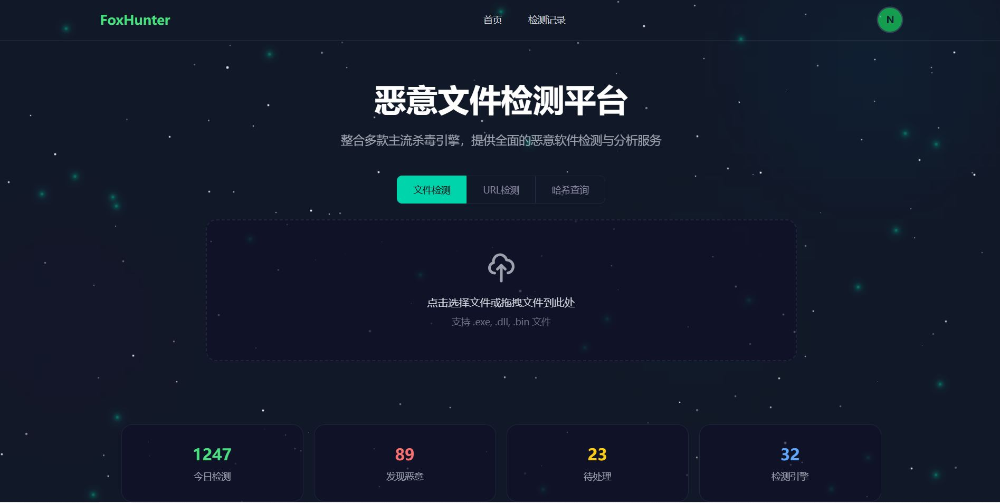
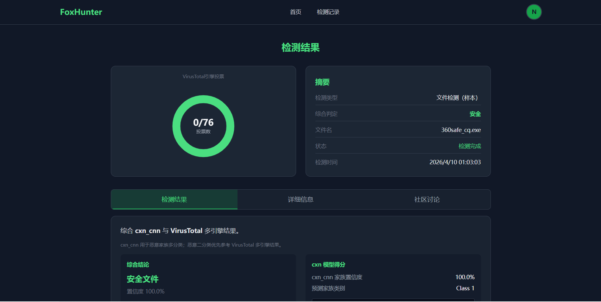

# FoxHunter Malware Detection System

FoxHunter 是一个基于 FastAPI + Celery 的恶意样本检测系统，支持上传检测、异步处理、结果查询和可视化展示。

## 核心功能

- 用户注册、登录、JWT 鉴权
- 上传 `.exe/.dll/.bin` 样本并异步检测
- 二进制转灰度图 + CNN 推理
- 检测结果查询、样本列表与删除
- URL 扫描与 Hash 情报查询（可选外部 API）
- 提供 `pytest`、`locust`、基准测试脚本

## 技术栈

- 后端：Python 3.11+, FastAPI, SQLAlchemy
- 异步任务：Celery + Redis
- 模型推理：TensorFlow / Keras
- 前端：Vue 3, Vite, Tailwind CSS
- 数据库：MySQL

## 项目结构

```text
foxhunter/
├── app/                     # 后端代码（路由、服务、模型、任务）
├── frontend/                # 前端代码
├── test/                    # 测试脚本（pytest / locust / benchmark）
├── model_assets/            # CNN 权重与类别映射
├── celery_app.py            # Celery 配置
├── requirements.txt
└── README.md
```

## 快速开始

1) 安装依赖

```bash
pip install -r requirements.txt
```

2) 准备基础服务

- MySQL（数据库建议使用 `foxhunter`）
- Redis（默认 `redis://localhost:6379/0`）
- 或使用 Docker：

```bash
docker compose up -d
```

3) 配置 `.env`（可参考项目示例），至少包含：

- `MYSQL_URL`
- `REDIS_URL`
- `JWT_SECRET_KEY`
- `CNN_WEIGHTS_PATH`
- `CNN_CLASS_INDEX_PATH`

4) 启动后端与任务进程

```bash
uvicorn app.main:app --reload --host 0.0.0.0 --port 8000
celery -A celery_app worker --loglevel=info
```


5) 启动前端

```bash
cd frontend
npm install
npm run dev
```

## 主要接口

| 方法 | 路径 | 功能 |
|---|---|---|
| POST | `/api/v1/auth/register` | 注册 |
| POST | `/api/v1/auth/login` | 登录（返回 JWT） |
| GET | `/api/v1/auth/me` | 获取当前用户 |
| POST | `/api/v1/upload` | 上传样本并触发异步检测 |
| GET | `/api/v1/samples` | 查询当前用户样本列表 |
| DELETE | `/api/v1/samples/{id}` | 删除样本记录 |
| GET | `/api/v1/result/{id}` | 查询检测结果 |
| GET | `/api/v1/url/scan` | URL 情报查询 |
| GET | `/api/v1/hash/scan` | Hash 情报查询 |
| GET | `/api/v1/health` | 健康检查 |

## 测试

- API 测试：`test/pytest/`
- 压测脚本：`test/locus/`
- 单元测试脚本：`test/unit/`

## 说明

- 上传文件类型：`.exe/.dll/.bin`
- 处理链路：上传 -> Celery 异步任务 -> 二进制转灰度图 -> CNN 推理 -> 结果入库
- 未配置 URLhaus / VirusTotal Key 时，相关接口可能返回降级状态
